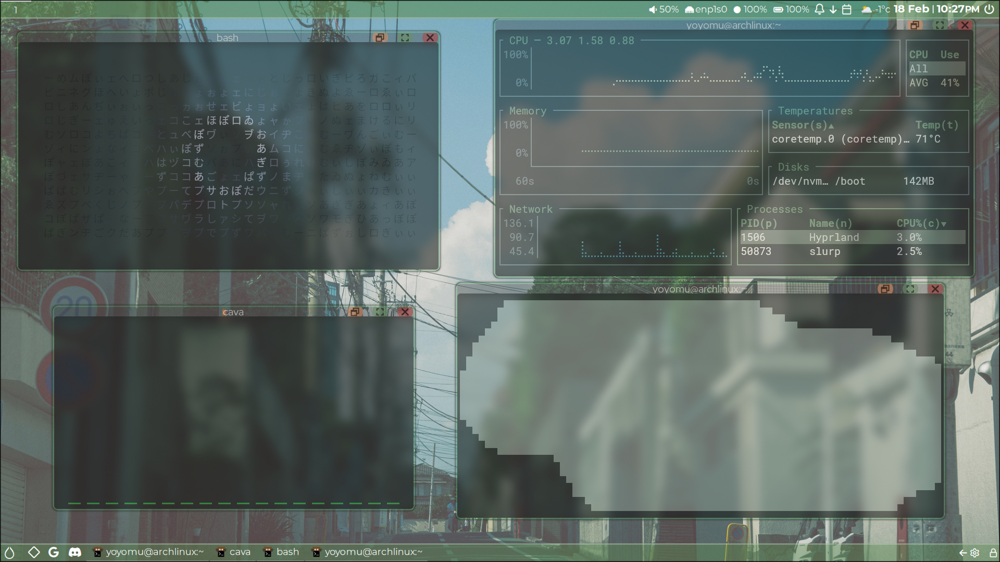

<h1 align="center">My Hyprland Config</h1>

---

## Overview

 is a dynamic tiling Wayland compositor based on wlroots that doesn't sacrifice on its looks.

- **Operating System**: `Arch Linux`
- **Window Manager**: `Hyprland`
- **Status Bar**: `Waybar`
- **App Launcher**: `Rofi`
- **Terminal**: `Kitty`

## Appearance

- GTK Theme: [Colloid-Green-Dark-Compact](https://github.com/vinceliuice/Colloid-gtk-theme/)
- Fonts: [Montserrat](https://github.com/JulietaUla/Montserrat)

## My Desktop

